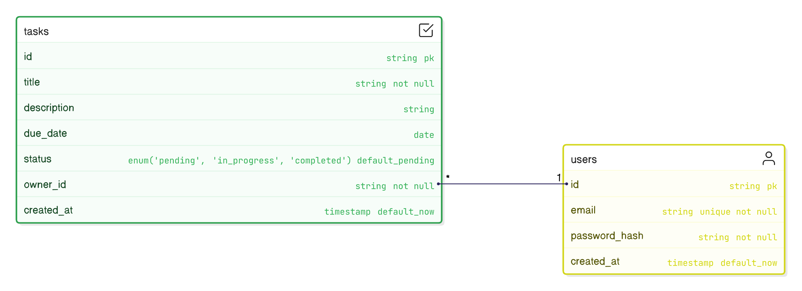

# Database Schema - TODO Management Application

The database schema is designed for **data integrity, security, and scalability**.  
It uses **PostgreSQL** as the relational database and **SQLAlchemy ORM with Alembic** for migrations.

---

## 1. Users Table
Stores all registered users of the system.

| Column        | Type       | Constraints                               | Description                          |
|---------------|-----------|-------------------------------------------|--------------------------------------|
| id            | SERIAL    | PK                                        | Unique identifier for each user       |
| email         | VARCHAR   | UNIQUE, NOT NULL                          | User’s login email                    |
| password_hash | VARCHAR   | NOT NULL                                  | Hashed password (Bcrypt)              |
| created_at    | TIMESTAMP | DEFAULT `now()`                           | Time of user registration             |

**Indexes**
- `UNIQUE(email)` → Ensures one account per email.
- `INDEX(created_at)` → Optimizes queries filtering by registration date (future analytics).

---

## 2. Tasks Table
Stores tasks created by users.

| Column      | Type       | Constraints                                          | Description                           |
|-------------|-----------|------------------------------------------------------|---------------------------------------|
| id          | SERIAL    | PK                                                   | Unique identifier for each task        |
| title       | VARCHAR   | NOT NULL                                             | Task title                             |
| description | TEXT      | NULLABLE                                             | Optional detailed task description     |
| due_date    | DATE      | NULLABLE                                             | Optional task deadline                 |
| status      | VARCHAR   | NOT NULL DEFAULT `'pending'` CHECK (status IN ('pending','in_progress','completed')) | Task state |
| owner_id    | INT       | NOT NULL, FK → `users(id)` ON DELETE CASCADE         | Owner of the task                      |
| created_at  | TIMESTAMP | DEFAULT `now()`                                      | Time task was created                  |

**Indexes**
- `INDEX(owner_id)` → Speeds up task lookups by user.
- `INDEX(status)` → Useful for filtering tasks by status (e.g., pending, completed).
- `INDEX(due_date)` → Allows efficient queries for upcoming deadlines.

---

## 3. Relationships
- **One-to-Many (1:N)**  
  - A user can have many tasks.  
  - Each task belongs to exactly one user (`owner_id`).  

### ER Diagram (Conceptual):
**Users (1) ────< Tasks (N)**


---

## 4. Example SQL DDL

### Users Table
```
CREATE TABLE users (
    id SERIAL PRIMARY KEY,
    email VARCHAR(255) UNIQUE NOT NULL,
    password_hash VARCHAR(255) NOT NULL,
    created_at TIMESTAMP DEFAULT CURRENT_TIMESTAMP
);
```
### Tasks Table
```
CREATE TABLE tasks (
    id SERIAL PRIMARY KEY,
    title VARCHAR(255) NOT NULL,
    description TEXT,
    due_date DATE,
    status VARCHAR(50) NOT NULL DEFAULT 'pending' 
        CHECK (status IN ('pending','in_progress','completed')),
    owner_id INT NOT NULL REFERENCES users(id) ON DELETE CASCADE,
    created_at TIMESTAMP DEFAULT CURRENT_TIMESTAMP
);
```